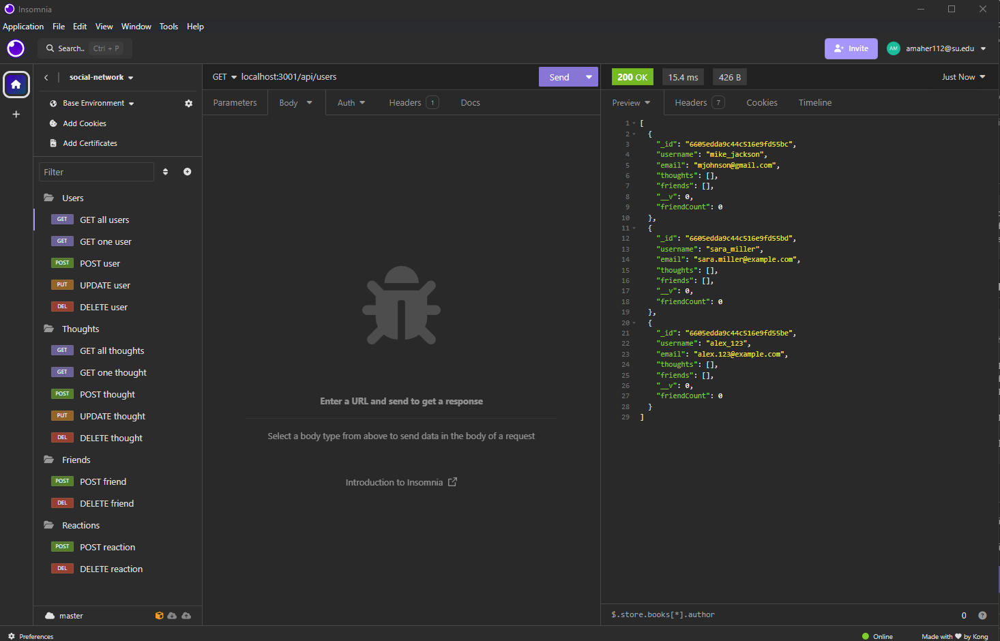

# Social Network API

## Description
The purpose of this project was to create a back-end social media application that handles users, thoughts and reactions. I was responsible for all the code and utilized Express and Mongoose. You are able to get, post, update, and delete users and thoughts. You are also able to add friends and reactions to thoughts. You can delete friends and reactions as well.

## Usage
Link to the walkthrough video: 
https://drive.google.com/file/d/19Q1EIpBgOd_ib_QH6tPlOqElM8mH25I2/view

